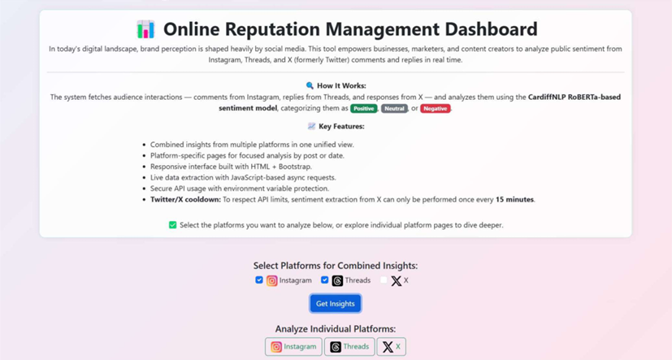
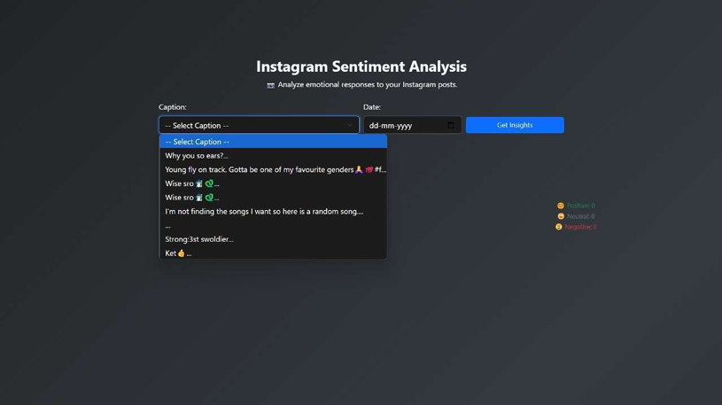

## Overview

This project is designed to:

- Fetch live audience interactions using:
  - Instagram Graph API
  - Threads Graph API
  - X (Twitter API v2)
- Perform sentiment analysis using the CardiffNLP RoBERTa-based transformer model
- Visualize insights using interactive dashboards
- Provide both combined and platform-specific analysis views

---

## Tech Stack

**Backend**
- Flask
- Transformers (HuggingFace)
- PyTorch
- Requests
- Python-dotenv

**Frontend**
- HTML
- Bootstrap 5
- JavaScript (Fetch API)
- Chart.js

**Deployment**
- Gunicorn (Production-ready WSGI server)

---

## Features

- Multi-platform unified dashboard
- Platform-specific analysis pages
- Real-time comment and reply extraction
- Sentiment classification (Positive / Neutral / Negative)
- Interactive filtering by sentiment
- Pie chart visualization of sentiment distribution
- Secure API key management using environment variables
- X API rate-limit cooldown handling (15-minute enforcement)

---

## Installation Guide

### 1. Clone the Repository
git clone https://github.com/your-username/your-repository-name.git
cd your-repository-name

### 2. Create Virtual Environment

python -m venv venv
venv\Scripts\activate

### 3. Install Dependencies
pip install -r requirements.txt

---

## Environment Configuration

### Create a .env file in the root directory:

INSTAGRAM_ACCESS_TOKEN=your_instagram_graph_api_token
THREADS_ACCESS_TOKEN=your_threads_graph_api_token
X_BEARER_TOKEN=your_x_api_v2_bearer_token
SECRET_KEY=your_flask_secret_key

### API Setup Requirements

#### Instagram & Threads

- Create an app via Meta Developer Console

- Generate a Graph API access token

= Enable permissions for comment retrieval

#### X (Twitter API v2)

- Create a project in X Developer Portal

- Generate a Bearer Token

- Enable tweet lookup and reply access permissions

- Running the Application Locally
  python app.py

Application will run at:

http://127.0.0.1:5000
Production Deployment (Optional)

## How to Use
Dashboard Mode (Multi-Platform)

- Open homepage.

- Select one or more platforms.

- Click Get Insights.

- View:
    Comment-level sentiment
    
    Aggregated distribution
    
    Interactive filtering
    
    Pie chart visualization
